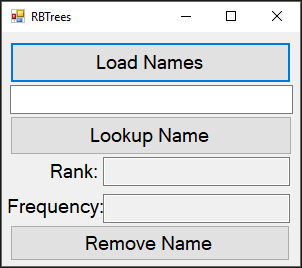
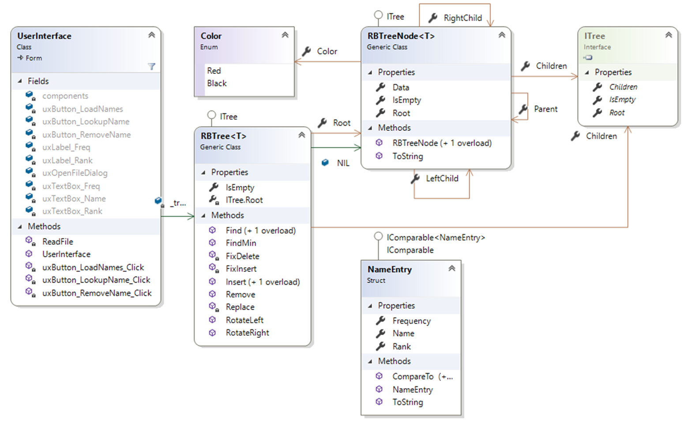
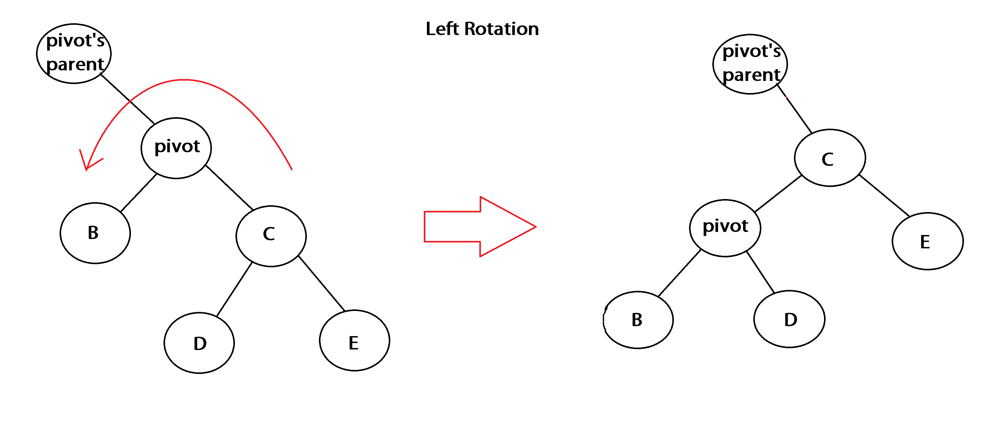
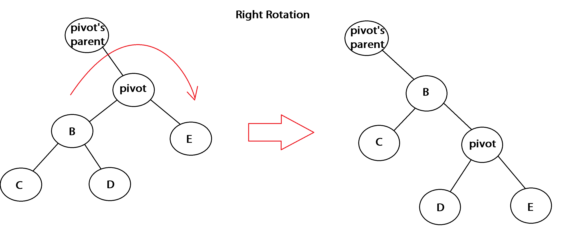

## User Requirements

For this assignment, you will be implementing a Red-Black tree.  This tree is used for many situations, including functionality of the Linux operating system.  A red black tree is simply a binary search tree where each node has been colored either **red** or **black**.  With this restriction, no path to a leaf node is more than twice the height of another.  As such, the height of a red-black tree is *log n* where *n* is the number of nodes.  Therefore, operations on this tree will run in the worst case, *O(log n)*.  To maintain this scenario, a red-black tree must follow a set of rules/properties:

1. Every node is colored either red or black

2. The root node is black

3. Every node that does not contain data (these are represented as NIL instead of null) is colored black

4. If a node is red, then both of its children must also be black

5. For each node, all paths from itself to descendant leaf nodes must contain the same number of black nodes (this can also be referred to as the black-height)

Operations on a red-black tree are quite like the ones done on a normal binary tree.  They differ in cases where the properties above must be maintained.  The details of these operations are detailed below in the code requirements; however, I recommend looking at the illustrations in this [resource](http://www.stolerman.net/studies/cs521/red_black_trees.pdf).  There is one small typo I have noticed in this resource: on page 1, where the tree is being corrected, for case 1, the second bullet should read “Color a’s grandparent (c) to red”.

## Starting the Assignment

Create a GitHub repository using [this URL](https://classroom.github.com/a/IgMkLAaJ). This repository will contain a Visual Studio solution and a folder **Data** containing different word-rank-frequency files that we have used in lab so far. Finally, it contains a sample executable contained in a zip folder called **hw4 exe.zip**. 

## User Interface

The user interface mimics the NameLookup project from class.  There are three **Buttons**, each with a click event handler.  There are also three text boxes.  The rank and frequency text boxes are **read only**.  To make the UI more readable, increase the font size to 12 or 14pt font.  The form itself should not be able to be resized.

## Software Architecture

You do not need to use the same names as shown in the class diagram, as long as you follow the [naming conventions](http://people.cs.ksu.edu/~rhowell/DataStructures/redirect/naming) for CIS 300. You may add any **private** methods that you feel improve the code.  

## Coding Requirements

The **NameEntry** class is given.  Note that to implement the **ITree** class as described below, you must add using KansasStateUniversity.TreeViewer2; to the corresponding files.

### The RBTreeNode Class

This class represents a red black tree node.  This is very much like a normal binary tree node, with the addition of a **Color** property.  This class is a generic class (of type *T)* that implements the **ITree** interface, and where *T* implements **IComparable.** In addition to this class, the RBTreeNode.cs file should also contain a public enumerator called **Color** that contains *Red* and *Black.*

#### Properties

- `public Color Color` 
- A property to store this nodes color.  This type  is of the enumerator described above.
    
- `public RBTreeNode<T> LeftChild `
- Represents the left child node of this node.
    
- `public  RBTreeNode<T> RightChild `
- Represents the right child node of this node
    
- `public RBTreeNode<T> Parent `
- Represents this node's parent.
    
- `public T Data `
- The data/key stored at this node.
    
- `public object Root `
- This is a property that is used by the ITree interface.  It should only have a *getter* that returns **this**.
    
- `public ITree[] Children `
- This is a property that is used by the ITree interface.  It should only have a *getter* that returns an  array of `RBTreeNode<T>`'s that has the LeftChild as the first  element and RightChild as the second element.
    
- `public  bool IsEmpty `
- This is a property that is used by the ITree interface.  It should only have a *getter* that returns whether or not the Data property equals the default value of T.  Be sure to use the **Equals** function of the Data property.

#### Methods

- `public RBTreeNode(T data, RBTreeNode<T> left, RBTreeNode<T> right) `
- Public constructor that sets the Data, LeftChild, and RightChild properties.
    
- `public RBTreeNode() `
- Public constructor that sets the Color property to Black.  Note that this is from the enumerator described above...NOT the C# Color class.
    
- `public override string ToString() `
- Converts this node to a string and returns the result.  The string should be in the format *Color: Data*

### The RBTree Class

This class represents a whole red black tree, storing its root.  This is a generic class (of type T) that implements the **ITree** interface and where *T* implements the `IComparable `and the `IComparable<T> `interfaces.

#### Fields

- `public static readonly RBTreeNode<T> NIL` 
- This should be set to a new RBTreeNode using the default constructor.  This is a special node in the red black tree.  While we will still have *some* **null** nodes, we will use **NIL** to represent the children of all *leaves* of the tree.

#### Properties

- `public RBTreeNode<T> Root `
- This is the Root property used to store the root node of the tree.  It has a public *getter* and a private *setter*.
    
- `object ITree.Root `
- This is a property that is used by the ITree interface.  It should only have a *getter* that returns **this**.
    
- `public ITree[] Children `
- This is a property that is used by the ITree interface.  It should only have a *getter* that returns the root node's **Children**.
    
- `public bool IsEmpty `
    - This is a property that is used by the ITree interface.  It should only have a *getter* that returns whether or not the root node is **null**.

#### Methods

*Note that the methods described below are **iterative** unless otherwise noted.*

- `public RBTreeNode<T> FindMin(RBTreeNode<T> node) `
- This is a simple function that finds the smallest RBTreeNode given the red black tree **node.**
    
- `private bool Find(T search, out RBTreeNode<T> result) `
- This function looks to find the given search data.  The function should return true if found, and false if not.  If the item is not found, the out parameter should be set to null.  Be aware that you will need to use the **CompareTo** function since you are dealing with **Data** which is a generic type.  Also be aware that instead of looking for null as your stopping point, you should stop looking when you find **NIL**.
    
- `public bool Find(T search, out T result) `
- Simply uses the **Find** function above to find the given data in the red black tree. If the item is not found, the out parameter should be set to the default value of **T**. 
    
- `public void RotateLeft(RBTreeNode<T> pivot) `
- This method will perform a single left rotation on the given red black tree node.  This is identical to the rotation described for [AVL Trees](http://people.cs.ksu.edu/~rhowell/DataStructures/trees/avl.html) in [Lab 20.](https://k-state.instructure.com/courses/92798/pages/lab-20-avl-trees?module_item_id=2133027) The only exception is that rotations are made under different conditions in red black trees, although for this function, you only need to worry about performing the rotation.  This rotation is slightly different compared to the one done in lab.  Here, you will have to move the pointers for the **LeftChild**, **RightChild**, and **Parent**.  Note that when looking for "null" values, you will use the traditional **null** when comparing to the **Parent** and **NIL** when comparing to the children.
    

 

- `public void RotateRight(RBTreeNode<T> pivot) `
- This is complete mirror to the **RotateLeft** function above.  That means ever point where you change the **LeftChild** you will instead change the **RightChild** and vice versa.
    

 

- `public void Insert(T data) `
- This is the base case for inserting into the red black tree.  If the **Root** is null, then this is the first node to be inserted into the tree.  Create a new **RBTreeNode** with the given data and **NIL** for both children.  Set the **Color** of the root to **Black.**   Otherwise, if the root's data is the same as the given data, throw a new **InvalidOperationException**.  If the data is valid for the root, call the **Insert** function below, passing a new **RBTreeNode** containing the data and **NIL** for both of its children.
    
- `private void Insert(RBTreeNode<T> newNode) `
- This method inserts the **newNode** in the red black tree.  This works identical to the normal binary tree insertion with a few exceptions.  You will need to move pointers instead of recreating the tree, and you will need to link the new node's **Parent** property.  Keep in mind that when looking for a leaf node, you should be comparing against **NIL**.  Once the node has been inserted, the tree may need to be repaired to maintain the properties of red black trees (described earlier in the assignment).  To do so, call the **FixInsert** function passing in the newly inserted node.
    
- `private void FixInsert(RBTreeNode<T> node) `
- This method fixes any case where the insertion of a node may have violated the properties of a valid red black tree.  The algorithm for this fix should loop while the node is not the root and its parent's color is red. 
      - If the node's parent is left child of my grandparent  (the parent of the node's parent), we have three cases that could  require adjusting the color of the nodes or rotating nodes in the tree. 
        - Case 1: The node's uncle (the node's grandparent's left child) is not **NIL** and is red.  For this case, we recolor the parent of node to be black, the uncle to be black, and the  grandparent to be red. Set the node to be equal to its grandparent.
        - If the node's uncle is black, we have two cases to  consider 
            - Case 2: The node is the right child of its parent.  We need to correct this so that the node is the left child of its parent.  Set the node to be equal to its parent, then rotate the node left.
            - Case 3:  The node is the left child of its parent.  Color the parent black, the    grandparent of the node red, and then rotate the grandparent of the node right.  Note that this case is executed regardless if case 2 is true.
      - The else case (the node's parent is the right child  of its grandparent) is an exact mirror (symmetric) to the three cases  above.
    
- `private void Replace(RBTreeNode<T> a, RBTreeNode<T> b) `

    - This method replaces node **a** with node **b**.  If the parent of **a** is null, then **b** becomes the new root.  Otherwise, if **a** is the left child of its parent, **a'**s parent's left child becomes **b**.  Otherwise, **a**'s parent's right child becomes **b**.  Finally, **b**'s parent becomes **a**'s parent.

- `public bool Remove(T item)`
    - This method will delete the node that matches the given item from the tree.   This will operate very closely to a deletion operation in a regular binary tree, but with a few extra conditions.  First you will need to get a hold of the node that matches the item by using the **Find** method.  If nothing is found, return false.  Otherwise, we need to keep track of a few bits of information.  The node that was found will be referred to as **r**.  We also need to keep track of the color of the node we are replacing, **oldColor**.  This is initially the color of **r**.  We will also keep track of the node that will be moving into place of the node we are removing (**r**)…this will be referred to as the **fix** node.
    - Case 1:  If **r**’s left child is **NIL**, that means there is no left  child and we can simply replace **r**.  First set **fix** to **r**’s right  child, then **Replace** **r** with **r**’s right child.
    - Case 2: This case is symmetric to case 1.

    - Case 3/4: In this instance, **r** has two children, so we cannot simply replace **r** right away.  We must setup its **successor**.

        - The **successor**   is the minimum (**FindMin**) node   of **r**’s right child.  Once found, the **oldColor** should be set to the **successor’s** color and **fix**   should be set to the **successor’s**   right child.
        - If the **successor’s**   parent is **r**, then **fix**’s parent should be set to   the **successor**.  Otherwise, we need to **Replace** the **successor** with its own right   child, set the **successor’s**   right child to be **r**’s right   child, and set the **successor’s**   right child’s parent to the **successor.**
        - Finally, once the **successor** has been correctly setup, we can **Replace** **r** with the **successor.**  After it has been replaced, set the   left child of the **successor**   to be the left child of **r**   and the parent of the **successor**’s   left child to be the **successor.** Then   set the color of the **successor**   to be **r**’s color.

    - If the **oldColor**  is black, that means the removal could have violated the properties of  the red black tree, therefore we must call **FixDelete** with the **fix**  node.

- `private void FixDelete(RBTreeNode<T> current)`
- This method is used to correct any violations made after deleting a node from the tree using the Remove function.  We have to continue to fix (loop while) the **current** node if it is not root and its color is black.  There is no need to fix the current node if it was red since it would not cause any violations of the tree (based on how we do the removal and insertion of nodes).
    - Scenario: The **current** node is the left child of its parent. There are four different cases:
    
    - (if) Case 1: The sibling node of **current** is red.  We need  to recolor the sibling to black and change the **current** parent to red.   Then, perform a left rotation on the parent of **current**. 
        - (if) Case 2:  Both  of the children of **current**’s  sibling are black.  We simply  recolor the sibling to be red and reset **current** to be its parent.
    
    - (else)
    
        - Case 3: The right child of **current**’s sibling is black.    Recolor the left child the sibling to black and the color of the   sibling to red.  Then perform a   right rotation
            - Case 4: Executes regardless if case 3 occurs.  The sibling’s color now becomes the **current**’s parent’s color.  The parent of **current** and the right child of the sibling are recolored to   black.  Then a left rotation is   done on the parent of **current**.  Once the rotation is done, **current** should be set to the   root.
    
- The second scenario is the exact mirror (symmetric) of the previous one.
    
- At the end of the method, **current** needs to be recolored to black.

### The UserInterface Class

This class represents the code behind the UI.  The UI is responsible for loading names from files into a red black tree, displaying it, remove, and find functionality.

#### Fields

- `private RBTree<NameEntry> _tree `
- The red black tree that is currently loaded.

#### Methods

- `public UserInterface()`
    - Default constructor.

- `private RBTree<NameEntry> ReadFile(string fn)`
    - This method reads in a given file using a stream reader into a **RBTree** containing **NameEntry** objects as node data.  The files should be formed as name, frequency, and rank, each on their own line, just as we have done in lab.  Once done, return the newly created tree.

- `private void uxButton_LoadNames_Click(object sender, EventArgs e)`
    - Using an **OpenFileDialog**, this click event handler reads a names file into the **_tree** field and creates shows the new tree (`new TreeForm(_tree, 10000).Show()`). If an error is thrown, it should be shown in a message box.

- `private void uxButton_RemoveName_Click(object sender, EventArgs e)`
    - This click event handler attempts to remove a name that was typed into the UI from the tree.  You can use dummy information for the rank and frequency for creating a temporary **NameEntry** object to use as a parameter for passing to the Remove or Find methods in the tree class.  If the name was removed, you should show that fact in a message box and display the new tree in a new **TreeForm**.  Otherwise, show an appropriate message to the user indicating failure.

- `private void uxButton_LookupName_Click(object sender, EventArgs e)`
- This click event handler tries to find the name given by the UI in the tree.  If it is found, the frequency and rank should be loaded into the corresponding text boxes.  Otherwise, a message should be displayed and the text boxes for frequency and rank should be cleared.

## Testing and Performance

There are a significant number of test cases that your code should pass. These are all included as part of the starting project.  In addition to the tests, your code should be able to load any of the given data files into a **valid** red black tree.  Likewise, the lookup and remove buttons should properly find and remove nodes from the tree.  You can use the model solution executable to check your trees.

## Submitting Your Assignment

Be sure to **refresh** your Team Explorer, **commit** all your changes, then **push** your commits to your GitHub repository. Then submit the *entire URL* of the commit that you want graded. There is no need to submit a comment, as you will not have a completion code.

**Important:** If the URL you submit does not contain the 40-hex-digit fingerprint of the commit you want graded, **you will receive a 0**, as this fingerprint is the only way we can verify that you completed your code prior to submitting your assignment. We will only grade the source code that is included in the commit that you submit. 

## A Note on the Executable Provided

The provided executable has been obfuscated to prevent decompiling to the original source code. Code decompiled from obfuscated code is difficult or impossible to understand. There exist deobfuscators that can make this decompiled code a bit more understandable, but it's still fairly obvious that it is obfuscated code. **Any use of code decompiled and/or deobfuscated from the provided executable will be considered as cheating.**

 
